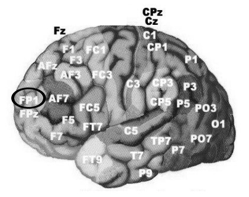
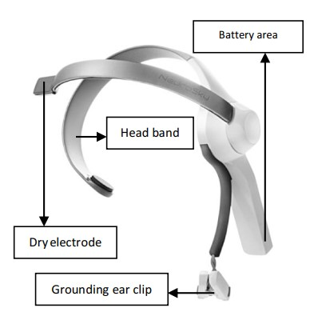
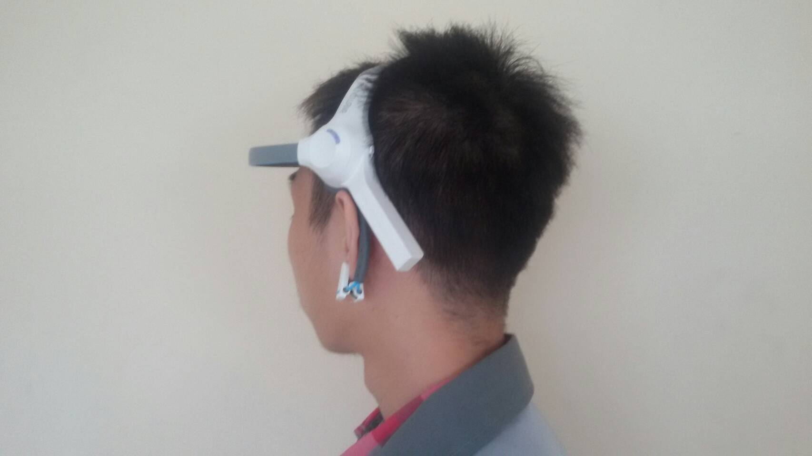
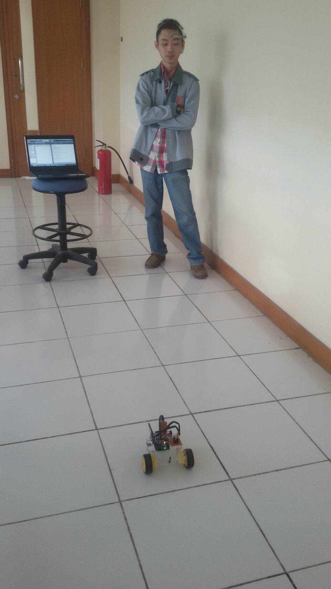

# BCI-RobotControl

    Technology is very essential in assisting human to live these days. One of such technologies is biomedical engineering technology, with specific area focusing on Electroencephalogram (EEG). The use of EEG is not only limited for detecting neurons activity inside human brain, but it can also be used for control purpose. The use of EEG in control system is called Brain Computer Interface (BCI). The ultimate goal of BCI in general is to assist people with disabilities to have activities as those of normal people do. In this project, the purpose of the resulted prototype is to help people with disabilities to transport light items by means of attention level and eye blinking level. Both are utilized to
    control the movement of a land mobile robot.

## Introduction

    Brainwave are differentiated into several types based on reaction and terms that may affect their fluctuations, they are Delta, Theta, Low Alpha, High Alpha, Low Beta, High Beta, Low Gamma, and High Gamma waves in general. From these differentiations, using the NeuroSky Mindwave EEG in particular, the eSense algorithm which has been embedded into the module will get the control variables of attention, meditation, and eyes blink level out of Alpha and Beta waves. 

    

Region of FP1 that is shown in the figure above. is where the dry electrode is positioned to take the user brain signal. FP1 region is also the closest part to the user’s left eye location such that the reading of eye blink is clearer in this region compared to that of other regions

## Main EEG used

    In its application, the EEG that is used is a low cost EEG namely NeuroSky Mindwave.

    

    The figure above shows the picture of EEG, where theelectrode will be placed on FP1 of Brodmann Atlas. After capturing the signal, it is then processed by eSense algorithm, an algorithm that has been embedded within the NeuroSky Mindwave. It can
    be accessed in MATLAB by applying the library Thinkgear.dll to get attention, meditation, and eye blink value

## Its Applicatoin

    

    The user should wear the NeuroSky Mindwave as shown in the figure above. Then, the EEG is calibrated with the Brainwave Visualizer software. After that, the MATLAB code in its m-file is executed (including eye blink detection and Bluetooth communication). There will be two variables that are plotted on the
    graph and sent in real time to the robot. One is attention value that is plotted each second, and another one is eye blink value that is plotted each
    time the user blinks. 
    In real time, whenever the values are plotted, they will also be sent into the microcontroller. Then, it allows the robot to be controlled and be able to
    move forward, turn left, turn right, rotate, and move backward as the user commands.

    

    The robot in action (picture above) shows the condition of the robot when it is
    controled. The robot movement will be based on the user condition in concentrating and eye blinking. 

